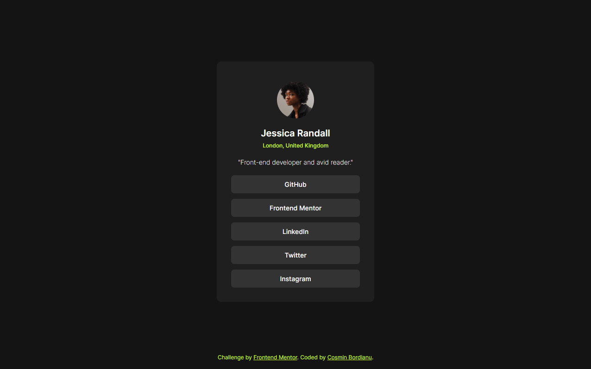

# Frontend Mentor - Social links profile solution

This is a solution to the [Social links profile challenge on Frontend Mentor](https://www.frontendmentor.io/challenges/social-links-profile-UG32l9m6dQ). Frontend Mentor challenges help you improve your coding skills by building realistic projects.

## Table of contents

- [Overview](#overview)
  - [Screenshot](#screenshot)
  - [Links](#links)
- [My process](#my-process)
  - [Built with](#built-with)
  - [What I learned](#what-i-learned)
- [Author](#author)
- [Acknowledgments](#acknowledgments)

## Overview

### Screenshot



### Links

- Solution URL: (https://your-solution-url.com)

## My process

### Built with

- Semantic HTML5 markup
- Flexbox
- CSS Grid

### What I learned

- CSS selectors

```css
.wrapper > *:not(:last-child):not(:nth-child(2)) {
  /* Select all elements inside wrapper without second and last child */
  margin-bottom: 2rem;
}
```

- Adding CSS reset file
- Changing default browser font to 62.5%

## Author

- GitHub - [@cosminbordianu](https://github.com/cosminbordianu)
- Frontend Mentor - [@cosminbordianu](https://www.frontendmentor.io/profile/cosminbordianu)
